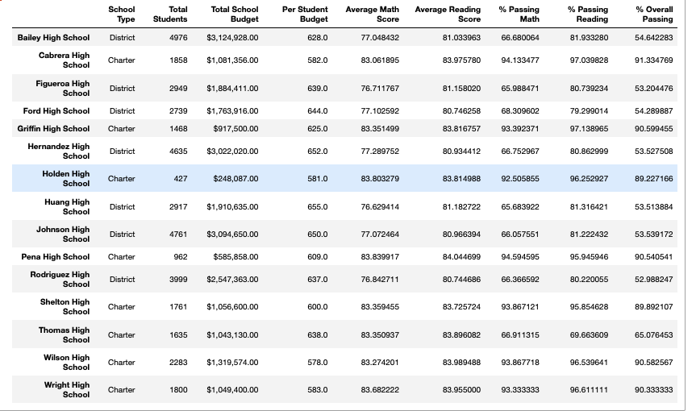
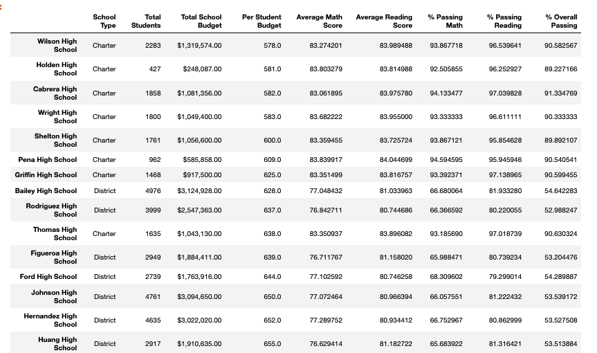
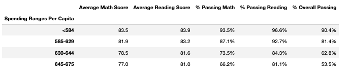
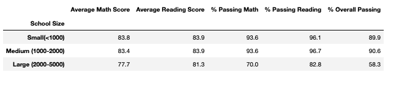
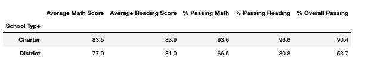

# School_District_Analysis
by Isaac D. Tucker-Rasbury, Future Data Scientist and Economist

## Overview of the School District Analysis
The objective of this analysis was to integrate a recent finding into the key performance metrics of the school district, namely that there is academic dishonesty at a particular school (Thomas High School) in a particular grade (9th). In this hypothetical audit of highschool reading and math scores within a school district, I have been instructed to systemically disregard the scores of Thomas High School's 9th grade math and reading scores and, furthermore, asked to to rerun the analysis. This write up is intended to describe how these changes affected the district analysis.

## Results
To discuss the impact of an alteration in the data without giving one's audience access to the before and after of the change is to do them a great disservice. Please see the original school district analysis and the modified district analysis which takes the recently discovered academic dishonesty at Thomas High School into account. Please take special note of the difference in Thomas High School's details and that, yes, it can be interpreted as an improvement in performance.

#### _Original School District Analysis_

#### _Modified School District Analysis_

Please see the below for a list of questions we have answered about what changed from the original and modified analysis. 

1. How is the district summary affected?
- In this scenario, we see the district summary faring better after modifying for the academic dishonesty. 

2. How is the school summary affected?
- In this scenario, we see the school summary faring better after modifying for the academic dishonesty. 

3. How does replacing the ninth graders' math and reading scores affect Thomas High School's relative to the other schools?
- Replacing the ninth graders' math and reading scores (and adjusting the school's averages to disregard those students) makes Thomas High School appear to be a strong skill academically speaking amongst its' district peers.

4. How does replacing the grade scores affect the following: 

- Scores by school spending
#### _Scores by School Spending_

After taking into account the academic dishonesty at Thomas High School, schools in the same spending per capita bracket  are still being outperformed by schools spending less per student. If the 9th graders were counted in the modified stats however the per capita spending would drop to the level of the higher performing spending per capita bracket beneath it.

- scores by school size
#### _Schools by School Size_

No material change.

- scores by school type
#### _Scores by School Type_

Replacing the grade scores at Thomas High School puts charter schools compartively well above district schools that would not be possible otherwise. The margin between the school types would be smaller if the grades were not replaced.

## Summary
The following material changes were made to the database.
1. Thomas High School's 9th grade scores have been replaced with zeros(NaNs to be exact).
2. Replacing this data had no impact on the scores by school size.
3. Replacing this data did have an impact on the per capita spending for Thomas High School.
4. There was no material change for scores by school type.
